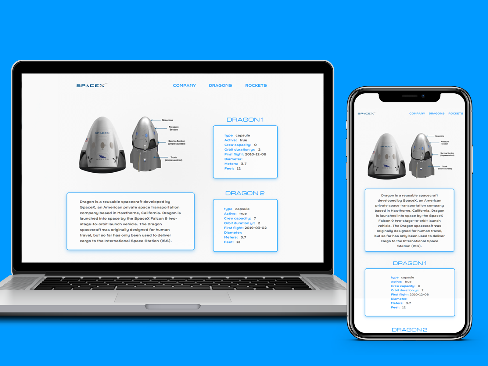

# SpaceX  -  Getting data from Space API
***
_The user can view information about SpaceX such as company information, launches and more._

_The data is obtained using Fetch for API requests (spaceX-API)._

_Realized in React using components, pages, hooks and our custom hook to handle status, loading and errors._

## View
***
_Just a preview._
* Preview: 

## Technologies
***
A list of technologies used within the project:
* [React.js](https://reactjs.org/) - A JavaScript library for building user interfaces
* [React Router](https://reactrouter.com/) - collection of navigational components that compose declaratively with your application.
* [SpaceX API](https://docs.spacexdata.com/) - *For details about API, please visit his WebSite
* Fetch
* Hooks
* CSS

## Site
***
https://spacex-phi.vercel.app/

 ## Others
 ***

This project was bootstrapped with [Create React App](https://github.com/facebook/create-react-app).
